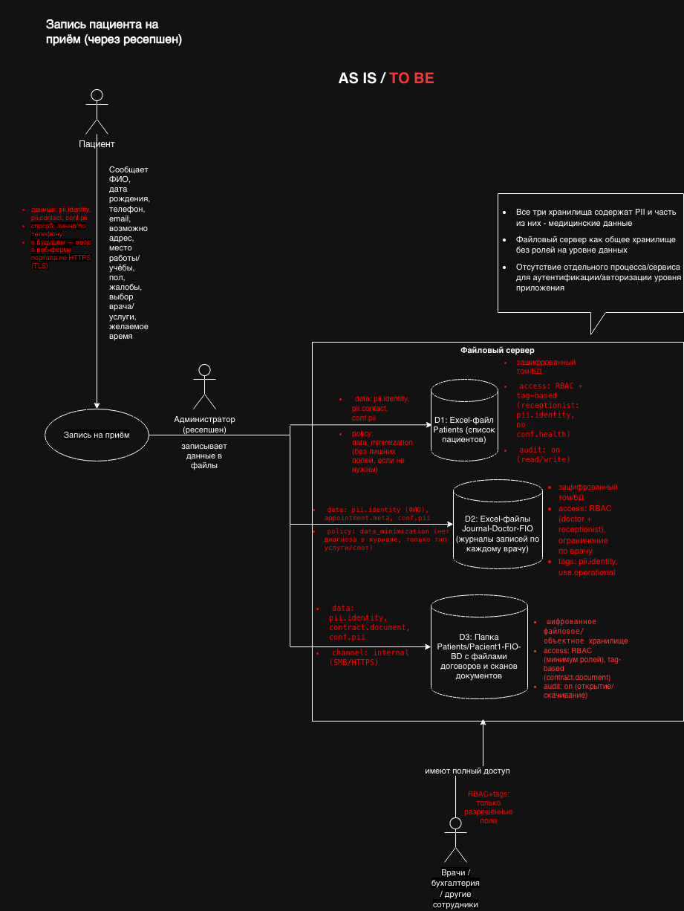
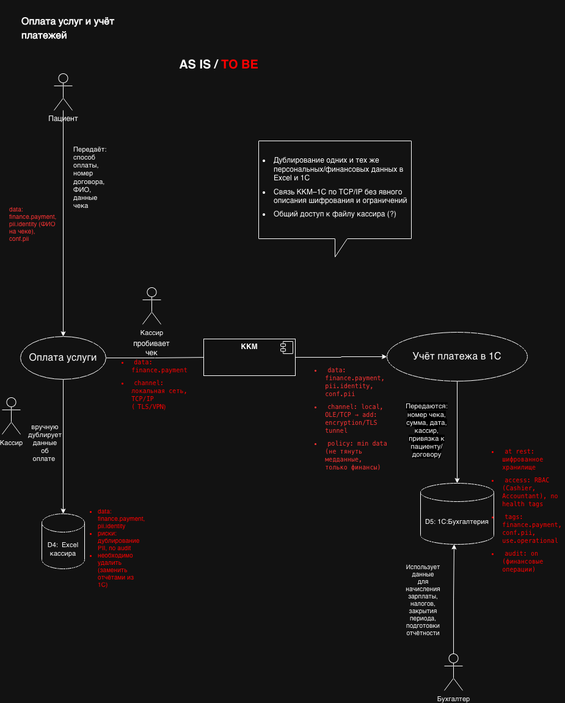
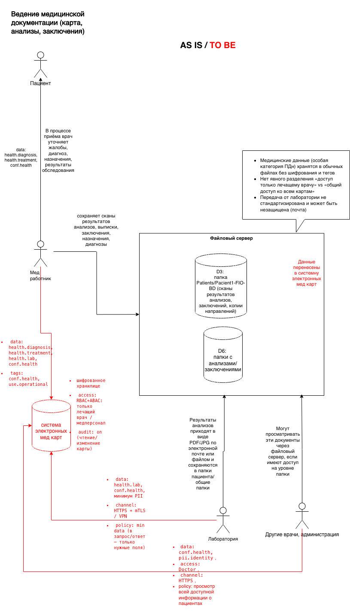
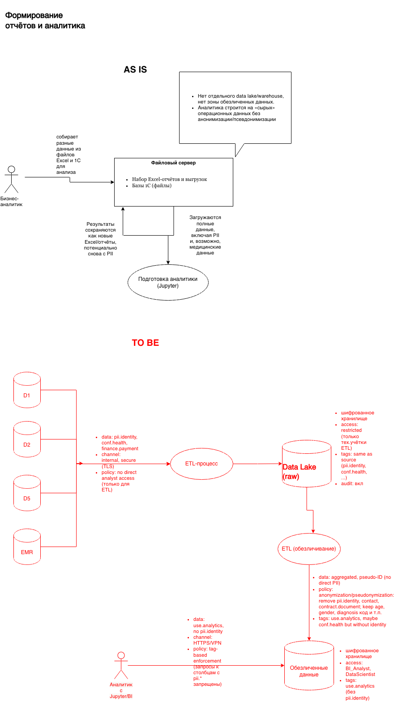

# Аудит безопасности

В ходе обследования были выявленные следующие проблемы в безопасности данных
- Отсутствие централизованной системы хранения медицинских данных:
  - данные о пациентах, история обращений, результаты анализов и договоры хранятся в Excel, JPG, PDF в общих папках на файловом сервере без жёсткого разграничения доступа
  - нет отдельного домена "медицинская карта" (в электронном виде), всё перемешано с операционными документами
- Широкий доступ к файловому хранилищу:
  - сотрудники ресепшена, врачи, бухгалтерия и склад имеют доступ к общим папкам (Journals, Patients и т.п.)
  - доступ контролируется только через доменную учётку AD, без ролевой модели уровня данных (RBAC/ABAC). Нет разделения на типы необходимых для работы сотрудников данных (нужен только список пациентов, нужно видеть диагнозы)
- Отсутствие аудита действий с файлами:
  - чтение/запись файлов Excel, JPG, PDF не логируются на уровне приложений; максимум — сырые логи файловой системы, которые никто системно не анализирует
  - нет журналирования "кто и когда открыл карту пациента N, что изменил, что выгрузил"
- Дублирование и разрозненность конфиденциальных данных:
  - PII и медицинские данные дублируются:
    - в Excel журнала записей к специалистам (Journal-Doctor-FIO)
    - в Excel-списке пациентов (Patients)
    - в сканах договоров и согласий в папках Patients/Pacient1-FIO-BD
    - в 1С:Бухгалтерия (ФИО, реквизиты для счетов, платежи)
    - в 1С:Торговля и склад (может быть часть PII и реквизитов для договоров с поставщиками)
  - это усложняет выполнение требований по минимизации данных и их удалению по запросу субъекта
- Нет формализованной классификации и тегирования данных:
  - нет схемы категорий: "общие данные пациента", "медицинские данные (особая категория)", "финансовые данные", "служебные технические идентификаторы", "логи" и т.д.
  - нельзя программно определить "это чувствительное поле — к нему особые требования"
- Отсутствуют механизмы минимизации данных (Privacy by Design / Data Minimization):
  - в формы/Excel и сканы попадает больше данных, чем нужно для конкретной операции (например, место работы/учёбы везде, где достаточно ФИО + телефон)
  - нет отдельного хранения контактов и отдельных — медицинских данных, во многих документах всё соединено
- Нет анонимизации/обезличивания для аналитики:
  - BI/ML/AI сейчас строятся (или будут строиться) поверх тех же Excel/сканов с прямыми PII
  - отсутствует pipeline, который отделяет "операционные данные" от "данных для аналитики", где должны быть обрезаны PII/заменены на стабильные псевдонимы
- Ненадёжный процесс интеграции с внешними системами (лаборатория анализов):
  - планируется интеграция по API, но текущая модель — "системы видят всё", нет продуманных контрактов, где наружу отправляются только минимально необходимые данные
  - нет единой Identity/Access модели для внешних контрагентов (лаборатории, партнёры)
- Ручная работа с данными и высокий риск человеческой ошибки:
  - много ручного копирования данных между Excel, 1С и файлами. Это создаёт риск утечек (случайная отправка не того файла, оставленный на рабочем столе Excel, экспорт на флешку и т.п.)
  - Отсутствуют технические ограничения на вынос данных (нет DLP, нет шифрования на уровне файлов, флешек, почты)
- Нет централизованной политики по срокам хранения и удалению:
  - не определены сроки хранения: кто и когда обязан удалить данные пациента при отзыве согласия, завершении договора и т.д.
  - в Excel и файлах данные остаются навсегда, что нарушает принцип минимизации и увеличивает риск утечки
- Нечёткое разграничение между операционными и техническими аккаунтами:
  - есть AD и LDAP, но нет выделенных сервисных учёток с минимальными правами для интеграций (например, ККМ–1С, 1С–файловый сервер)
  - пользователи могут запускать скрипты и выгружать большие объёмы данных без ограничений
- Слабая или отсутствует защита каналов связи и рабочих мест:
  - не описано использование шифрования каналов (TLS внутри сети, VPN для удалённого доступа)
  - Не указаны меры по шифрованию рабочих станций, политике блокировки экрана, запрету установки ПО пользователями

## 1. Список данных для защиты
- Идентификационные данные пациента:
  - ФИО, дата рождения, пол, СНИЛС/полис, серия/номер паспорта, адрес регистрации/проживания, место работы/учёбы, телефон, email
  - источники: формы на ресепшене, Excel Patients, Excel Journals, сканы документов в папках
- Медицинские данные (особая категория):
  - жалобы, диагнозы, назначенные/проведённые процедуры, результаты анализов, выписки, заключения
  - источники: сканы в папках Patients/анализы, внутренние документы врача, ответы от лабораторий
- Финансовые данные:
  - информация о платежах, чеках, договорах, скидках, задолженностях
  - источники: Excel кассира, 1С:Бухгалтерия, договоры/акты в папках
- Данные о взаимодействии с системой:
  - журналы записей (когда, к кому и на что записан), история посещений, отмены
  - источники: Excel Journals, потенциально будущий портал
- Технические и служебные данные:
  - логи доступа, технические идентификаторы (ID записи, ID пациента), системные журналы
  - сейчас практически не используются для аудита

## 2. Механизм тегирования данных
### 2.1 Модель тегов (категории и уровни)
   Предлагаемая схема классов тегов для "Медикаменте" опирается на практики сегментации и тегирования медданных (HL7/FHIR confidentiality tags)

#### Тип данных:
- `pii.identity` — идентификационные данные пациента (ФИО, дата рождения, паспорт, СНИЛС, адрес)
- `pii.contact` — контакты (телефон, email)
- `health.diagnosis` — диагнозы, жалобы
- `health.lab` — результаты анализов
- `health.treatment` — назначения, процедуры, назначения лекарств
- `finance.payment` — данные о платежах, чеки, суммы
- `contract.document` — договор, согласие, сканы подписанных документов
- `meta.log` — журналы действий, технические логи.
#### Уровень конфиденциальности:
- `conf.public` — данные, допустимые к публикации (почти ничего из текущих потоков в медицине сюда не попадает)
- `conf.internal` — служебные данные, не содержащие ПДн (например, справочник услуг)
- `conf.pii` — персональные данные
- `conf.health` — медицинские данные (особая категория)
- `conf.high` — особенно чувствительные данные (например, психиатрия, ВИЧ, репродуктивное здоровье, если будут)
#### Назначение/режим использования:
- `use.operational` — для операций (запись, приём, оплата)
- `use.analytics` — для BI/ML/AI (обезличенные/псевдонимизированные представления)
- `use.external` — данные, допустимые к выходу наружу через API/отчёты партнёрам (минимальный состав полей)

В реализации это могут быть отдельные поля в модели (например, JSON-столбец tags в Postgres) и/или централизованный словарь в системе управления данными, например, 1С.

### 2.2 Где и как хранить теги
- В операционных сервисах (EMR / CRM / портал):
  - в каждой сущности (Patient, Appointment, LabResult, Payment) добавить поле tags (JSONB в Postgres) или отдельную таблицу entity_tags(entity_id, tag_key, tag_value)
  - правила: при создании или изменении записи сервис присваивает теги по схеме ("фамилия" → pii.identity + conf.pii + use.operational, "результат анализа" → health.lab + conf.health + use.operational)
- В data lake / хранилище:
  - при загрузке данных из операционных систем в озеро данных — отдельный слой метаданных (catalog), где хранятся теги по колонкам/таблицам (например, Glue Data Catalog, Hive Metastore, DataHub, Amundsen — в будущем)
  - для каждого столбца: column_name, data_type, tags (например: tags = ["pii.identity","conf.pii","use.analytics"])
- В интерфейсах и API:
  - в описании DTO / API-схем (OpenAPI/Swagger) — аннотация полей метаданными (через x-tags или аналог), чтобы линтеры и проверки на CI/CD могли валидировать, что нельзя выдать наружу поле с тегом `conf.health` в "публичном" API

### 2.3 Как использовать теги в логике доступа
- RBAC/ABAC поверх тегов:
  - RBAC: роли (Doctor, Receptionist, Cashier, Accountant, BI_Analyst, Admin)
  - Матрица доступа "роль → разрешённые теги":
    - Doctor: чтение/запись `conf.health`, `conf.pii` по своим пациентам
    - Receptionist: чтение/запись `pii.identity`, `pii.contact`, только ограниченный просмотр статусов приёма, без диагнозов
    - Cashier: `finance.payment`, минимальный набор `pii.identity` (ФИО) без медданных
    - BI_Analyst: только `use.analytics` и не `conf.health` в идентифицируемом виде — доступ к обезличенным слоям
  - ABAC: в политике учитываются атрибуты:
    - тег поля/ресурса
    - роль пользователя
    - отношение к пациенту (лечащий врач / не лечащий)
    - контекст (внутренняя сеть/внешний доступ, филиал и т.д.)  
- Доступ на уровне систем:
  - в сервисе доступа к данным (data access layer) вводится правило: "если набор тегов атрибутов записи пересекается с запрещёнными для роли тегами — поле не возвращать / возвращать замаскированным / отказать в операции"
  - для API: перед сериализацией ответа просматриваются теги полей; если вызывается внешний партнёрский API, автоматически исключаются поля с `conf.health` и `conf.pii`, если явно не разрешено политикой
- Валидация на CI/CD:
  - политики проверок: "в endpoint /public/* запрещено возвращать поля с тегом `conf.health` или `conf.pii`", "запросы в аналитическое озеро не могут выбирать столбцы с тегом `pii.identity` без явного процесса деперсонализации"
  - инструменты статического анализа схем (например, самописный скрипт, который читает OpenAPI + JSON схемы и проверяет теги)

## 3. Инструменты, способы и меры для обеспечения конфиденциальности
### 3.1. На уровне хранения
- Шифрование:
  - шифрование дисков серверов, особенно для файловых хранилищ с медданными и бэкапами
  - шифрование на уровне БД (TDE в Postgres через сторонние расширения или прозрачное шифрование на уровне тома)
  - для особо чувствительных документов (например, сканы с диагнозами) — хранение в зашифрованном объектном хранилище, с доступом только через сервис-слой
- Сегментация хранилищ:
  - разделить операционные БД (EMR/CRM) и аналитическое озеро
  - в аналитическом слое хранить только деперсонализированные/псевдонимизированные данные (ID пациента → псевдо-ID, без ФИО, контактов)
- Ролевое разделение:
  - разные схемы/базы для: медицинских данных, финансовых, справочников, логов
  - разные права на схемы: врачи не видят финансовые детали, кассиры — диагнозы
### 3.2. На уровне передачи
- Шифрование каналов:
  - внутренние сервисы: HTTPS/TLS между компонентами и между филиалами (VPN + TLS)
  - интеграция с лабораторией: REST/HTTPS с mTLS или защищённый VPN-канал
- Минимизация данных в интеграциях:
  - в API для лаборатории передавать только необходимые атрибуты: внутренний `lab_order_id` + минимум PII (например, псевдо-ID + дата рождения, если достаточно), а полные PII хранить у "Медикаменте" и связку делать локально

### 3.3. На уровне приложений и процессов
- Авторизация и аутентификация:
  - единый Identity Provider (Keycloak/аналог) с SSO для портала, внутренних систем и интеграций
  - MFA для работников с доступом к `conf.health`
  - строгая RBAC/ABAC с использованием тегов, как описано выше
- Маскирование и минимизация в UI:
  - в интерфейсах ресепшена и кассы скрывать медицинские поля; отображать только то, что нужно для операции
  - маскирование чувствительных полей (частичный вывод, например только последние цифры номера документа) в списках, полный вид — только в деталях и только для уполномоченной роли
- Обезличивание для аналитики:
  - ETL-пайплайн, который:
    - выкидывает ФИО, телефоны, email, документы
    - заменяет ID пациента на псевдо-ID (одинаковый для всех аналитических таблиц)
    - при необходимости агрегирует данные (по возрастным группам, а не конкретной дате рождения).

### 3.4. Аудит, мониторинг и обнаружение аномалий
- Логирование доступа:
  - для всех операций чтения/записи данных с тегами `conf.pii` и `conf.health` писать в журнал: кто, когда, какой объект/поле (хотя бы по ID), с какого устройства/филиала
  - логи хранить в системе сбора (Elastic / VictoriaMetrics + Loki / другой стек логирования) с ограниченным доступом
- Детекция аномалий:
  - настроить алерты:
    - необычно массовые выгрузки медданных одним пользователем
    - доступ к большому числу пациентов, с которыми врач не связан
    - доступ из необычных мест/времени
    - В будущем — использовать ML/поведенческую аналитику для обнаружения утечек
- Периодический аудит:
  - регулярный пересмотр ролей, доступов, списка тегов и политик
  - проверки соответствия законодательству (локальному аналогу GDPR, требованиям Роскомнадзора и медицинских регуляторов)

### 3.5. Организационные меры
- Политики и обучение:
  - политика классификации и обработки данных: что такое `conf.pii`, `conf.health`, как с ними работать
  - обучение персонала (ресепшен, врачи, касса, аналитики) по правилам работы с медданными и запрету несанкционированных копий (домашние флешки, личная почта)
- Процедуры удаления и ответа на запросы субъектов:
  - формальные процедуры по удалению/ограничению обработки данных пациента (когда поступает запрос)
  - для этого тегирование помогает быстро найти все места, где есть данные этого пациента, и грамотно удалить/анонимизировать их

## Диаграммы потоков данных
- запись пациентов 

[DFD-patient-appointment.drawio](DFD-patient-appointment.drawio)

- платежи

[DFD-payments.drawio](DFD-payments.drawio)

- ведение медицинской документации

[DFD-medical-records.drawio](DFD-medical-records.drawio)

- отчеты и аналитика

[DFD-reports-and-analytics.drawio](DFD-reports-and-analytics.drawio)

