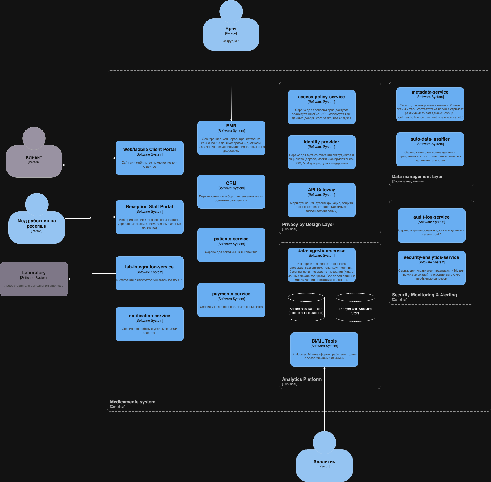

# Состав и назначение сервисов в целевой архитектуре

| Контейнер                      | Назначение                                                                                        | Основные связи                                                                                                         | Особенности Privacy by Design                                                                                                             |
|--------------------------------|---------------------------------------------------------------------------------------------------|------------------------------------------------------------------------------------------------------------------------|-------------------------------------------------------------------------------------------------------------------------------------------|
| Web/Mobile Client Portal       | Сайт или мобильное приложение для клиента (запись, просмотр своих анализов/заключений, договоров) | API Gateway, Notifications Service                                                                                     | Доступ только к данным пациента; проверка токена (IdP) и политик (PDP); минимум полей в ответах; шифрование TLS                           |
| Reception Staff Portal         | Веб‑приложение для ресепшена (запись, управление расписанием, базовые данные пациента)            | API Gateway                                                                                                            | Не видит медданные; доступ только к `pii.identity` и статусов; авторизация через IdP + PDP по тегам                                       |
| EMR UI                         | Интерфейс врача для работы с медкартой                                                            | API Gateway                                                                                                            | Полный доступ к `conf.health` только для своих пациентов; MFA; все действия логируются в audit-log-service                                |
| API Gateway                    | Единственная точка входа для клиентов и сотрудников                                               | Все внешние веб/мобильные‑клиенты, backend services, access-policy-service                                             | Termination TLS, rate limiting; PEP: проверка токенов, вызов access-policy-service для high‑risk операций, отрезание полей в ответе       |
| Identity Provider (IdP)        | Аутентификация, SSO, управление ролями (интеграция с существующим AD)                             | API Gateway, Portals, backend services, Windows Server / AD                                                            | Реализует логин, токены (OIDC/OAuth2); источник атрибутов пользователя для PDP (роль, отдел и т.п.)                                       |
| Access Policy Service          | Централизованный движок авторизационных политик и тег‑базового доступа                            | API Gateway, backend services, metadata-service, IdP                                                                   | Реализует RBAC/ABAC, учитывает теги полей (`conf.pii`, `conf.health`, `use.analytics`), возвращает Permit/Deny/Mask                       |
| Patients Service               | Сервис персональных данных пациента (ФИО, контакты, документы)                                    | EMR, CRM, ETL                                                                                                          | Очень ограниченный доступ, хранит только PII, все связи через patient_id, шифрование данных, полный аудит                                 |
| EMR                            | Медкарта: визиты, диагнозы, назначения, результаты анализов                                       | Patients Service, Lab Integration Service, Portals через API Gateway, ETL                                              | Не хранит ФИО/контакты, данные с тегами `conf.health`, все запросы проходят через access-policy-service, строгий аудит чтения/записи      |
| CRM                            | Запись на приём, управление расписанием, напоминания                                              | Patients Service, Reception Portal, Notifications Service, ETL                                                         | Не хранит диагнозов, только слоты, статусы и минимум данных пациента; теги `pii.identity`, `use.operational`                              |
| Payments Service               | Логический слой над 1С для учёта платежей, связка оплат с patient_id                              | 1С:Бухгалтерия, Portals, ETL                                                                                           | Отделён от медданных, работает с `finance.payment`, запросы пациентов/кассиров проходят через access-policy-service                       |
| Lab Integration Service        | Интеграция с лабораторией анализов по API                                                         | External Lab System, EMR, Patients Service                                                                             | На внешние вызовы — только минимальные атрибуты (идентификатор направления, псевдо‑ID пациента), TLS/mTLS, политики PDP                   |
| Notifications Service          | Уведомления (SMS, email, push, голосовой робот)                                                   | CRM/EMR, внешние каналы                                                                                                | Получает только нужные PII (телефон/email), без медданных в тексте, шаблоны сообщений проверены на отсутствие чувствительного содержимого |
| Metadata Service               | Реестр схем и тегов данных (какие поля где, какие теги)                                           | access-policy-service, ETL, backend services                                                                           | Центр управления тегами; Dev/CI использует его для валидации схем и API; поддерживает принципы Privacy by Default.                        |
| Audit Log Service              | Централизованный аудит доступа к данным                                                           | API Gateway, backend services, ETL                                                                                     | Логирует все операции с тегами `conf.*`, отдельное шифрованное хранилище, доступ только службе безопасности                               |
| Security Monitoring & Alerting | Аналитика логов безопасности и аномалий                                                           | Audit Log, системные логи                                                                                              | Правила/ML для обнаружения утечек и нетипичных действий, алерты в команду                                                                 |
| Data Ingestion Service         | Загрузка данных из операционных систем в аналитический контур                                     | EMR, CRM, Patients Service, Payments, 1С, Raw Data Lake, Main Anonymized Store,access-policy-service, Metadata Service | На входе применяет минимизацию, псевдонимизацию и фильтрацию по тегам, сам доступ к PII строго ограничен                                  |
| Secure Raw Data Lake           | Сырой слой данных                                                                                 | ETL                                                                                                                    | Шифрование, доступ только системным аккаунтам, используется как промежуточный слой, не для обычной аналитики                              |
| Anonymized Analytics Store     | Основное хранилище для BI/ML (деперсонализированные данные)                                       | ETL, BI Tools, ML Platform                                                                                             | Не содержит `pii.identity`, теги `use.analytics`, доступ аналитиков только сюда                                                           |
| BI / Reporting Tools           | Отчёты, дашборды (P&L, ABC, мед.метрики)                                                          | Anonymized Analytics Store                                                                                             | Работают только с обезличенным слоем, ограничения по тегам через PDP/каталог                                                              |
| ML / AI Platform               | Обучение моделей (прогнозы загрузки, no‑show, мед.аналитика)                                      | Anonymized Analytics Store                                                                                             | Нет прямого доступа к PII, соблюдение PbD в pipeline                                                                                      |

[project-medicamente-to-be.drawio](project-medicamente-to-be.drawio)

