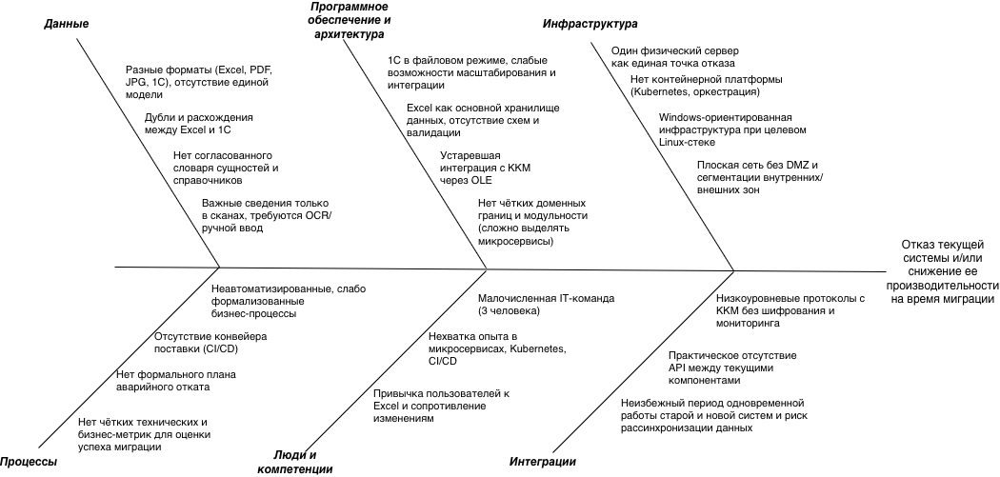

# Оценка узких мест при миграции системы "Медикаменте"

## 1. Краткий анализ текущей ситуации

Текущая система опирается на один физический сервер с Windows Server 2022, Excel‑файлы и 1С в файловом режиме. 
Данные распределены между Excel, 1С, JPG/PDF и общими шарами, интеграции построены на устаревших механизмах (TCP/IP + OLE). 
План — переход к микросервисной архитектуре (Java, PostgreSQL, Kubernetes), запуск клиентского портала и мобильного приложения, масштабирование на новые филиалы и приведение обработки ПДн/медданных к требованиям законодательства РФ.

---

## 2. Узкие места
### Инфраструктура
- Один физический сервер как единая точка отказа
- Нет контейнерной платформы (Kubernetes, оркестрация)
- Windows‑ориентированная инфраструктура при целевом Linux‑стеке
- Плоская сеть без DMZ и сегментации внутренних/внешних зон

### Программное обеспечение и архитектура
- 1С в файловом режиме, слабые возможности масштабирования и интеграции.
- Excel как основной хранилище данных, отсутствие схем и валидации.
- Устаревшая интеграция с ККМ через OLE.
- Нет чётких доменных границ и модульности (сложно выделять микросервисы).

### Данные
- Разные форматы (Excel, PDF, JPG, 1С), отсутствие единой модели.
- Дубли и расхождения между Excel и 1С.
- Нет согласованного словаря сущностей и справочников.
- Важные сведения только в сканах, требуются OCR/ручной ввод.

### Интеграции
- Низкоуровневые протоколы с ККМ без шифрования и мониторинга.
- Практическое отсутствие API между текущими компонентами.
- Неизбежный период одновременной работы старой и новой систем и риск рассинхронизации данных.

### Люди и компетенции
- Малочисленная IT‑команда (3 человека).
- Нехватка опыта в микросервисах, Kubernetes, CI/CD.
- Привычка пользователей к Excel и сопротивление изменениям.

### Процессы
- Неавтоматизированные, слабо формализованные бизнес‑процессы.
- Отсутствие конвейера поставки (CI/CD).
- Нет формального плана аварийного отката.
- Нет чётких технических и бизнес‑метрик для оценки успеха миграции.

---

## 3. Сжатые рекомендации и приоритеты

### Критичный приоритет (до активной миграции)
- Развернуть отдельную инфраструктуру/облако для новой системы, убрать единственную точку отказа.
- Определить "источник истины" по ключевым сущностям (пациент, приём, платёж, ТМЦ).
- Описать и протестировать план аварийного отката (DR/rollback).
- Увеличить ресурс разработки (найм/подряд на Java(или другой выбранный стек)/DevOps).
- Спроектировать механизм синхронизации данных на период параллельной работы систем.

### Высокий приоритет (первый этап миграции)
- Развернуть клстер k8s и базовый мониторинг/логирование.
- Спроектировать доменную модель и схемы данных под PostgreSQL.
- Настроить ETL‑процессы переноса данных из Excel в БД.
- Перевести 1С в серверный режим или обернуть интеграционным слоем.
- Построить CI/CD для новых сервисов.
- Провести обучение сотрудников работе с новой системой.

### Средний приоритет (последующие шаги)
- Внедрить полноценный мониторинг и алертинг (метрики, логи, дашборды).
- Сегментировать сеть, выделив DMZ для внешних сервисов.
- Организовать процесс оцифровки сканов (OCR + верификация).
- Переработать интеграцию с ККМ на современный протокол (REST API поверх защищённого канала).

---

## 4. Ключевые метрики успеха миграции
- Частота деплоев: ≥ 1 раз в неделю
- Время доставки изменений (lead time): < 1 рабочего дня
- Время восстановления (MTTR): < 1 часа
- Доля неудачных релизов: < 10–15%
- Точность миграции данных: > 99,9% по основным сущностям
- Доступность системы в период миграции: > 99,5%
- Доля сотрудников, перешедших на новую систему: > 90% за 3 месяца

---

## 5. Диаграмма Исикава
[migration-ishikawa-diagram.drawio](migration-ishikawa-diagram.drawio)

